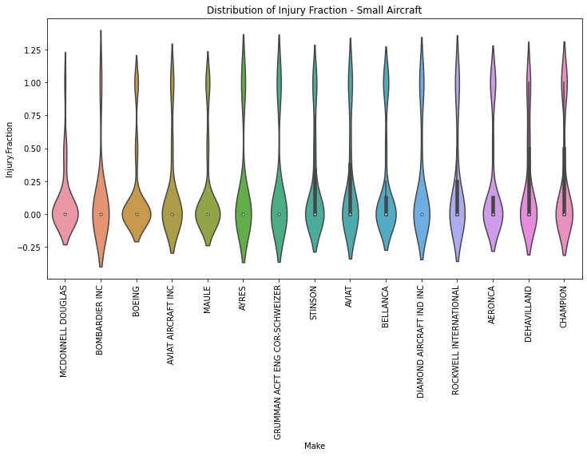

# Aviation Accident Analysis

## Project Overview

This project analyzes aviation accident data from the National Transportation Safety Board (NTSB) to identify aircraft makes and models associated with lower accident severity. The analysis was conducted from the perspective of a consulting firm advising an airline or aircraft insurer seeking to make evidence-based decisions regarding aircraft safety.

The objective is to determine which professional aircraft currently likely to remain in service (1983–2023) demonstrate lower rates of aircraft destruction and lower probabilities of fatal or serious passenger injuries following an accident. The project also investigates operational factors that contribute to accident severity.

## Business Problem

An airline/aircraft insurer requires recommendations on aircraft makes and models that demonstrate favourable safety performance.

Specifically, the client wants to identify aircraft that:

- Exhibit low rates of total aircraft destruction.
- Have lower proportions of fatal and serious passenger injuries.
- Can reasonably still be in active service (aircraft manufactured within approximately the last 40 years).
- Are analysed separately for small aircraft and larger passenger aircraft.
- Are supported by statistical evidence and exploratory data analysis.

The client also requested an investigation into operational factors that influence accident severity.


## Objectives

The project aimed to:

- Clean and prepare aviation accident data for analysis.
- Create safety metrics measuring passenger injury severity and aircraft destruction.
- Explore safety performance across aircraft manufacturers and models.
- Compare safety outcomes between small and large aircraft.
- Investigate how operational conditions influence accident outcomes.
- Recommend aircraft makes and models with favourable safety characteristics.

## Dataset

The analysis uses the **National Transportation Safety Board (NTSB) Aviation Accident Database**, containing aviation accident records from **1948–2023**.

To reflect aircraft that could still reasonably remain in service, the dataset was filtered to include accidents occurring from **1983 onwards**. Amateur-built aircraft were excluded to focus on professionally manufactured aircraft.

## Data Cleaning

The cleaning process included:

- Removing duplicate records.
- Handling missing values.
- Converting dates into datetime format.
- Filtering accidents from 1983 onwards.
- Excluding amateur-built aircraft.
- Creating total occupant counts.
- Calculating:
  - Fatality Rate
  - Serious Injury Rate
  - Fatal/Serious Injury Fraction
  - Aircraft Destruction Indicator
- Separating aircraft into:
  - Small Aircraft (<20 occupants)
  - Large Aircraft (20 or more occupants)


## Exploratory Data Analysis

The analysis examined:

### Aircraft Makes

Manufacturers were compared using:

- Mean fatal/serious injury fraction
- Aircraft destruction rate

Separate analyses were performed for:

- Small aircraft
- Large aircraft

Bar charts and violin plots were used to compare average injury rates and the distribution of accident outcomes.





### Aircraft Models

Aircraft models were evaluated using the same safety measures to identify models associated with lower accident severity while considering sample sizes.


### Operational Risk Factors

Two operational factors were investigated:

- Weather Conditions
- Phase of Flight


Visualisations and summary statistics were used to assess their relationship with aircraft damage and passenger injury outcomes.

## Key Findings

### Aircraft Manufacturers

Large aircraft manufacturers with comparatively favourable safety outcomes included:

- McDonnell Douglas
- Boeing
- Embraer
- Airbus

Among small aircraft manufacturers, favourable results were observed for:

- Boeing
- Aviat Aircraft Inc.
- Maule
- Ayres
- Grumman Aircraft Engineering Corporation–Schweizer

Manufacturers demonstrating both low aircraft destruction rates and low fatal/serious injury fractions provided the strongest evidence of favourable safety performance.

### Operational Factors

#### Weather Conditions

Accidents occurring during Instrument Meteorological Conditions (IMC) generally resulted in higher average fatal and serious injury fractions than those occurring during Visual Meteorological Conditions (VMC), indicating that adverse weather contributes to increased accident severity.

#### Phase of Flight

The highest injury fractions were observed during:

- Maneuvering
- Approach
- Take-off

Taxi operations generally recorded the lowest injury severity.

These findings suggest that critical flight phases require additional operational attention and risk management.

## Recommendations

Based on the analysis:

### Large Aircraft

Recommended manufacturers include:

- McDonnell Douglas
- Boeing
- Embraer
- Airbus

### Small Aircraft

Recommended manufacturers include:

- Boeing
- Aviat Aircraft Inc.
- Maule
- Ayres
- Grumman Aircraft Engineering Corporation–Schweizer

Recommendations are based on a combination of:

- Low aircraft destruction rates.
- Low fatal and serious injury fractions.
- Consistency of safety performance across recorded accidents.
- Consideration of sample size where appropriate.

Operational safety initiatives should also prioritise:

- Improved weather-related operational decision-making.
- Enhanced pilot training during critical phases of flight, particularly manoeuvring, approach and take-off.


## Technologies Used

- Python
- Pandas
- NumPy
- Matplotlib
- Seaborn
- Jupyter Notebook


## Repository Structure

```
├── data/
│   └── AviationData.csv
│
├── Aviation Accident Cleaning.ipynb
├── Aviation Accident Data Analysis.ipynb
├── README.md
└── images/
```

## Conclusion

This analysis demonstrates that aviation safety should be evaluated using multiple complementary measures rather than relying solely on accident counts. Manufacturers exhibiting both low aircraft destruction rates and low passenger injury severity provide stronger evidence of favourable safety performance.

Furthermore, operational conditions such as adverse weather and critical phases of flight significantly influence accident severity. These findings provide practical insights that can support aircraft selection, underwriting decisions, operational risk management, and future safety improvements within the aviation industry.

